# Public Syndromic Surveillance Platform

**Explainable Public Health Signal Intelligence Using Public Aggregate and Synthetic Data**

The Public Syndromic Surveillance Platform is an applied public health informatics prototype for reviewing unusual emergency department visit patterns, geographic risk signals, short-term surveillance trends, data quality, and responsible AI-assisted analyst workflows.

The platform demonstrates how public aggregate and synthetic surveillance-style data can be transformed into explainable signal intelligence through ETL, feature engineering, anomaly detection, risk scoring, geospatial review, forecasting, retrieval-augmented question answering, and research-style documentation.

This is an independent research prototype. It is not an official public health system, clinical system, government system, or operational response tool.

## Platform Purpose

Public health teams often need to recognize unusual illness or injury patterns before confirmed diagnosis data are complete. Emergency department visit trends and syndrome categories can provide earlier awareness of respiratory illness, overdose-related harms, heat illness, gastrointestinal illness, injury patterns, mental health concerns, and other emerging conditions.

This application demonstrates a modern surveillance analytics workflow that helps reviewers answer:

- Which state, region, or syndrome should be reviewed first?
- Is current activity unusual relative to recent baseline behavior?
- Which syndrome is driving geographic risk?
- How are anomaly and risk scores generated?
- Is the data complete enough to support interpretation?
- What does the forecast suggest, and how reliable is it?
- What evidence exists in the repository to support the implementation?

## Current Application Tabs

The Streamlit application is organized into reviewer-friendly sections:

| Tab | Purpose |
|---|---|
| Overview | Explains the platform, review path, responsible-use boundary, and key metrics. |
| Signal Review | Shows priority state/syndrome signals, observed values, baselines, deviations, anomaly scores, risk scores, risk levels, and review notes. |
| Analytics Engine | Explains the model stack, feature outputs, anomaly logic, risk scoring, and model output interpretation. |
| Query Assistant | RAG-based public health query assistant for plain-language questions about data, signals, charts, methods, and limitations. |
| Policy Briefing | RAG-based briefing assistant for leadership-style summaries, review priorities, governance caveats, and planning context. |
| Geography | Shows state-level risk rankings, primary risk drivers, geospatial prioritization, and map-based risk review. |
| Forecasting | Shows observed trends, anomaly context, short-term forecasts, model metrics, and limitations. |
| Data Quality | Reviews completeness, missingness, duplicates, coverage, and data boundaries. |
| Methods | Documents ingestion, cleaning, features, anomaly detection, forecasting, risk scoring, NLP, RAG, and synthetic HL7 concepts. |
| Technical Whitepaper | Research-paper style explanation of the problem, architecture, models, LLM/RAG design, evaluation, governance, limitations, and repository evidence. |

## Screenshots

Add website screenshots to `docs/screenshots/` using the filenames below. The README will display them automatically once the image files are present.

Recommended capture width: 1440px or wider for desktop screenshots.

### Overview Page

Shows the platform summary, public health problem framing, review path, metrics, and whitepaper reference.

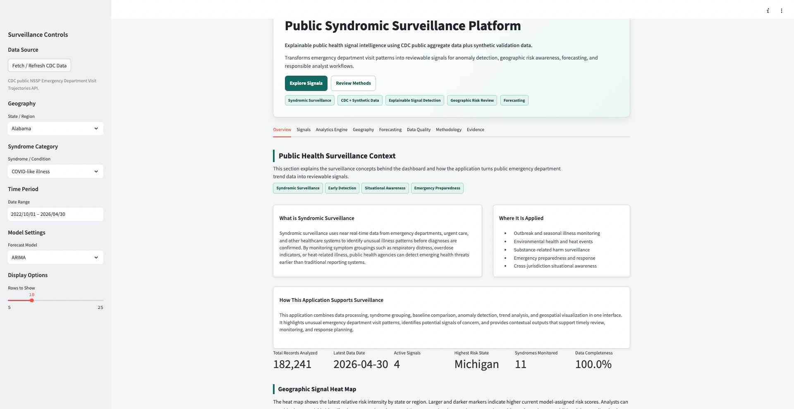


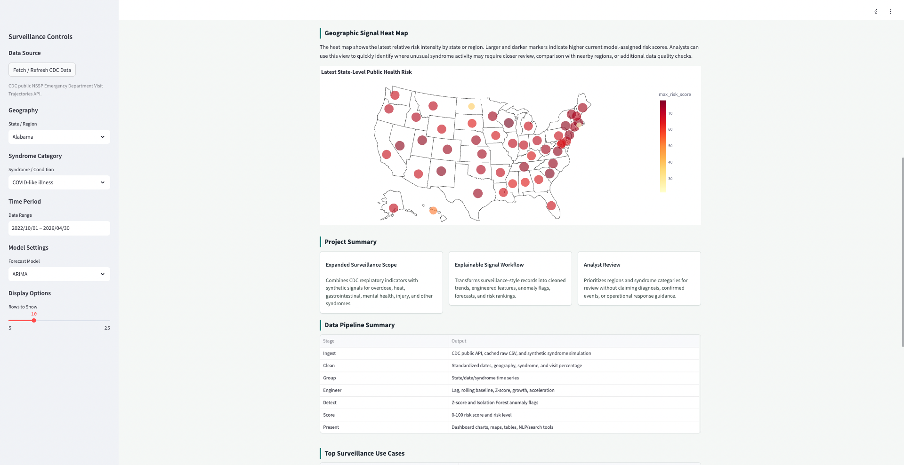

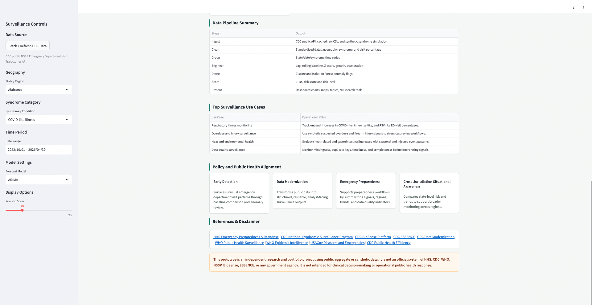

### Signal Review

Shows priority signal review with observed value, baseline, deviation, anomaly score, risk score, risk level, and review note.

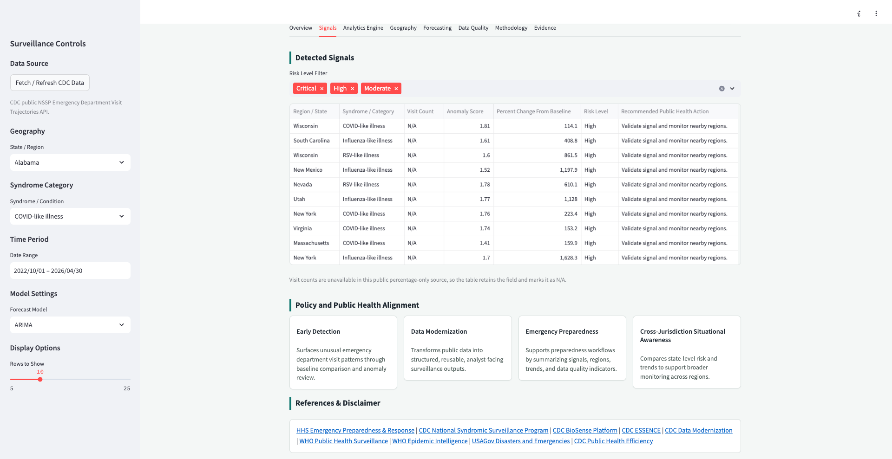

### Analytics Engine

Shows the model workflow, explainable model outputs, rolling baseline, z-score, Isolation Forest, risk scoring, and forecasting context.

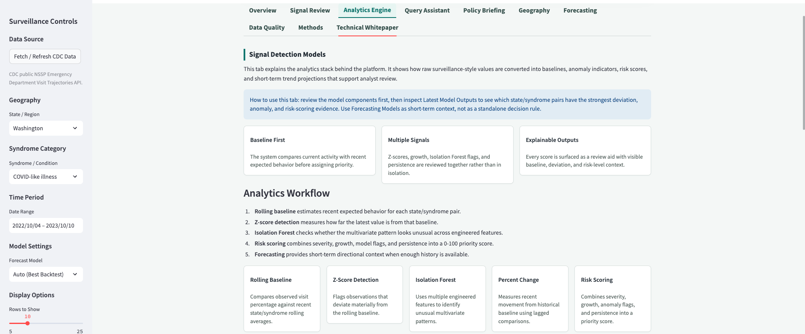

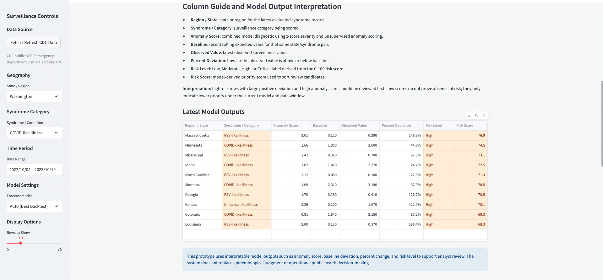

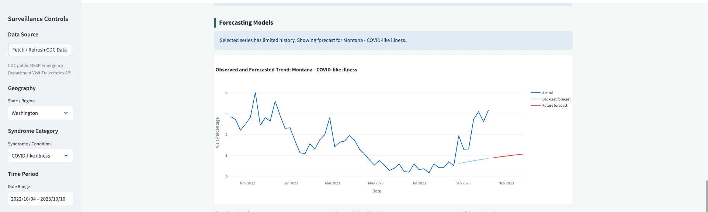

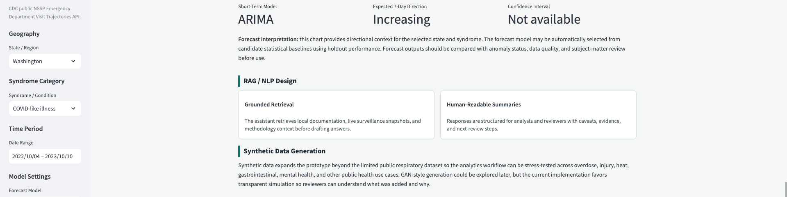

### Public Health Query Assistant

Shows the RAG-based assistant for plain-language questions about signals, charts, methods, data quality, and limitations.

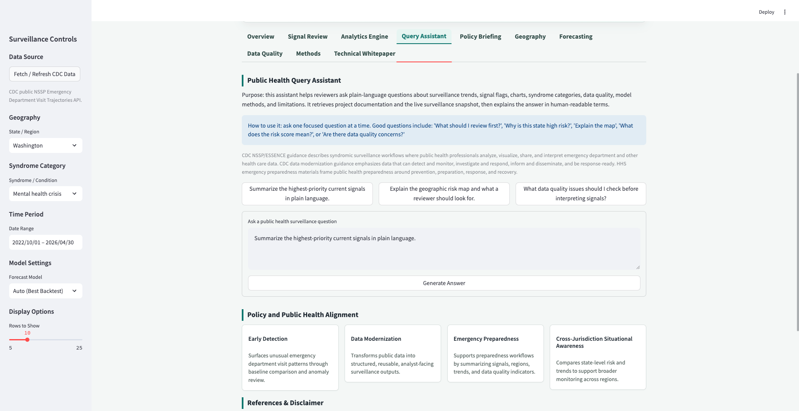

### Policy Briefing Assistant

Shows the RAG-based policy briefing assistant for leadership-ready summaries, governance caveats, and review priorities.

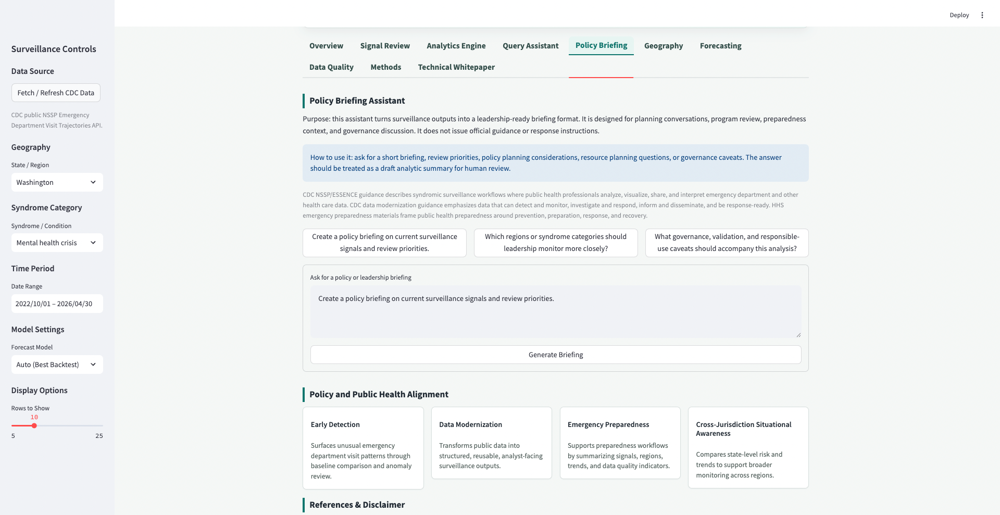

### Geographic Risk

Shows the geospatial risk map, state-level rankings, primary syndrome risk driver, and column guide.

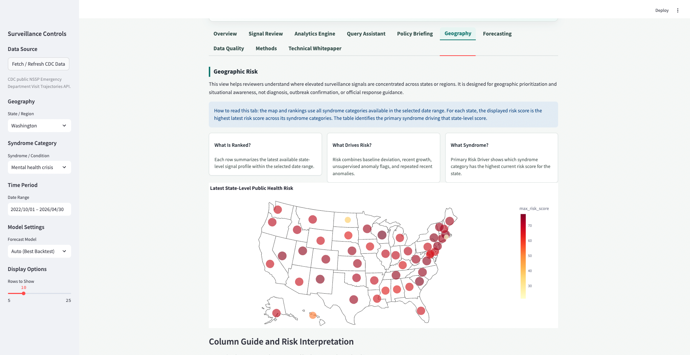
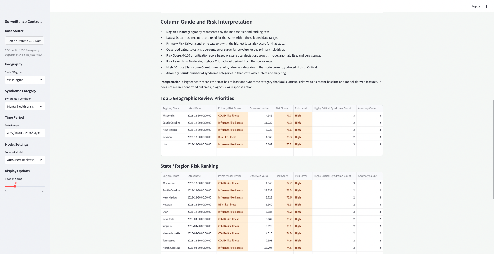


### Forecasting

Shows observed trends, anomaly markers, model-selected forecasts, and model metrics such as MAE, RMSE, sMAPE, and WMAPE.

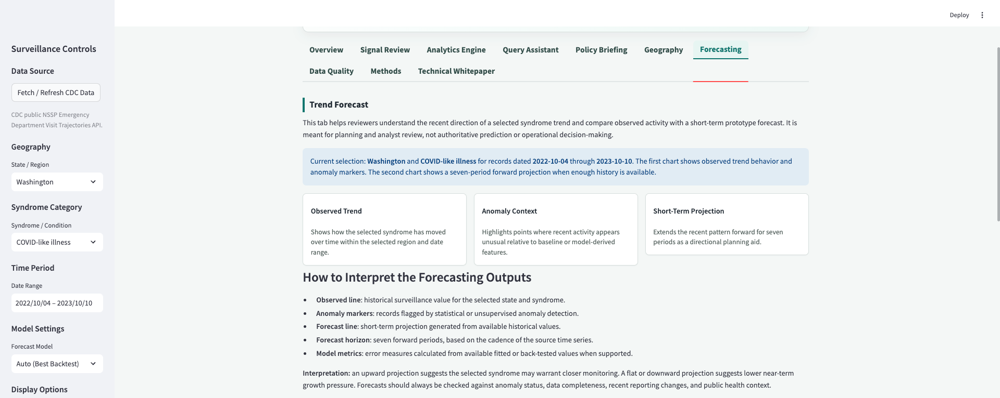

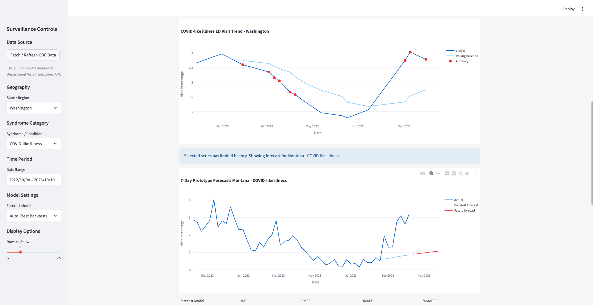

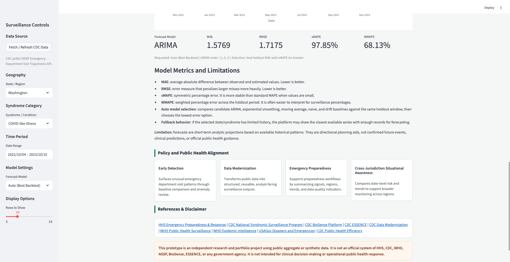

### Data Quality

Shows data completeness, missingness, duplicate checks, transformed record counts, and coverage metrics.


### Technical Whitepaper

Shows the research-style explanation of the system architecture, model rationale, LLM/RAG design, evaluation, governance, limitations, and repository evidence.


## Current Dataset Snapshot

The processed dataset is stored at:

```text
data/processed/cdc_nssp_ed_trajectories_processed.csv
```

Current processed dataset:

| Metric | Current Value |
|---|---:|
| Processed analytic records | 182,241 |
| Date range | 2022-10-01 to 2026-04-30 |
| States / regions | 51 |
| Syndrome categories | 11 |
| Anomaly-flagged records | 5,468 |
| High-risk records | 2,396 |
| Critical-risk records | 0 |
| Data completeness | 100.00% |

Monitored syndrome categories:

- COVID-like illness
- Influenza-like illness
- RSV-like illness
- Gastrointestinal illness
- Heat-related illness
- Suspected opioid overdose
- Mental health crisis
- Suicide-related behavior
- Firearm injury
- Rash and fever syndrome
- Neurological symptoms

The dataset combines public aggregate respiratory surveillance indicators with synthetic validation data for broader applied use-case testing. Synthetic data is used only for research, demonstration, and model stress testing.

## System Architecture

```text
Public Aggregate Data + Synthetic Validation Data
        |
        v
Data Ingestion
        |
        v
Cleaning, Standardization, and Data Quality Checks
        |
        v
Feature Engineering
        |
        v
Anomaly Detection and Forecasting
        |
        v
Risk Scoring and Geospatial Aggregation
        |
        v
RAG-Based Query and Briefing Assistants
        |
        v
Streamlit Analyst-Facing Application
```

Core architecture layers:

| Layer | Role |
|---|---|
| Data ingestion | Loads public CDC aggregate data, cached raw files, and synthetic syndrome validation data. |
| Cleaning and standardization | Standardizes dates, geography, syndrome fields, numeric values, missingness, and duplicate checks. |
| Feature engineering | Computes lag features, rolling baselines, z-scores, percent change, and trend acceleration. |
| Anomaly detection | Runs transparent z-score detection and unsupervised Isolation Forest anomaly detection. |
| Risk scoring | Converts severity, growth, anomaly flags, and persistence into a 0-100 risk score and risk level. |
| Geospatial analytics | Aggregates state-level risk and identifies primary syndrome risk drivers. |
| Forecasting | Compares short-term statistical models and baseline models using holdout performance. |
| RAG assistants | Retrieve local documentation and live surveillance summaries for grounded natural-language responses. |
| Streamlit presentation | Presents metrics, charts, maps, tables, explanations, assistants, and the technical whitepaper. |

## Models and Analytics

### Signal Detection

The signal detection workflow uses multiple interpretable components:

- Rolling baseline by state/syndrome
- Rolling standard deviation
- Z-score anomaly detection
- Percent change from historical lag
- Trend acceleration
- Isolation Forest anomaly detection
- Recent anomaly persistence
- Composite risk scoring

### Risk Scoring

Risk score is a bounded 0-100 prioritization score that combines:

- Statistical deviation severity
- Positive recent growth
- Isolation Forest anomaly flag
- Recent anomaly persistence

Risk levels:

- Low
- Moderate
- High
- Critical

Risk scores support analyst prioritization only. They do not confirm outbreaks, diagnoses, or official response needs.

### Forecasting

The forecasting module supports:

- Auto model selection using holdout performance
- ARIMA candidate selection
- Exponential Smoothing variants
- Moving Average baseline
- Naive baseline
- Drift baseline
- Prophet support when available

The app reports:

- MAE
- RMSE
- sMAPE
- WMAPE
- selected model
- selected ARIMA order or moving-average window when applicable

Forecasting outputs are short-term analytic projections. They are directional planning aids, not authoritative predictions.

### RAG and LLM Assistant Design

The application includes two retrieval-augmented assistant workflows:

- Query Assistant
- Policy Briefing Assistant

The assistants retrieve from:

- local project documentation
- model summaries
- data dictionary
- public health use-case notes
- live surveillance snapshot generated from the currently loaded dataset
- CDC/HHS-oriented guidance summary embedded in the app context

If an `OPENAI_API_KEY` is configured, the assistant uses the configured LLM model. The current default is:

```text
gpt-4.1-mini
```

If no API key is available, the assistant falls back to retrieval-only responses based on the top matching local context.

Assistant outputs are constrained to:

- plain-language explanation
- retrieved evidence
- analyst review steps
- caveats and responsible-use boundary

The assistants are not designed to provide medical advice, diagnosis, treatment guidance, official directives, or autonomous response instructions.

## Technical Whitepaper

The app includes an in-app `Technical Whitepaper` tab. This is the main research-style reference for the prototype.

It covers:

- public health problem and motivation
- system architecture
- data boundary and dataset strategy
- model selection and rationale
- model and LLM inventory
- RAG prompting and grounding design
- applied surveillance use cases
- evaluation approach
- responsible AI and governance
- limitations
- repository evidence map
- conclusion

This tab is intended to help reviewers understand not only what the app does, but why the architecture, models, and responsible-use boundaries were chosen.

## How to Run

Install dependencies:

```bash
pip install -r requirements.txt
```

Optional: create a local `.env` file for LLM-backed RAG generation:

```text
OPENAI_API_KEY=your_openai_api_key_here
OPENAI_MODEL=gpt-4.1-mini
```

Run the dashboard:

```bash
streamlit run app.py
```

Then open the local Streamlit URL shown in the terminal, usually:

```text
http://localhost:8501
```

## Repository Structure

```text
app.py                         Streamlit application
config.yaml                    Data and model configuration
src/                           Ingestion, cleaning, features, models, RAG, geospatial, HL7, and visualization modules
data/raw/                      Raw public and synthetic source files
data/processed/                Processed analytic surveillance dataset
docs/screenshots/              Website screenshots used by this README
docs/whitepaper_assets/        Charts and figures generated for documentation
reports/data_dictionary.md     Data fields and processing definitions
reports/model_summary.md       Model and analytics documentation
reports/public_health_use_cases.md
tests/                         Unit tests
```

## Key Source Files

| File | Purpose |
|---|---|
| `src/data_ingestion.py` | Loads public CDC data, cached raw files, and synthetic syndrome data. |
| `src/data_cleaning.py` | Transforms raw surveillance-style extracts into standardized analytic records. |
| `src/feature_engineering.py` | Creates lag, rolling baseline, z-score, percent change, and acceleration features. |
| `src/anomaly_detection.py` | Implements z-score and Isolation Forest anomaly detection. |
| `src/risk_scoring.py` | Converts model outputs into interpretable risk scores and levels. |
| `src/forecasting.py` | Supports short-term forecasting, auto model selection, and fallback projections. |
| `src/geospatial.py` | Prepares state-level data for map-based risk review and primary risk-driver identification. |
| `src/rag_assistant.py` | Supports grounded question answering over app data and documentation. |
| `src/synthetic_data.py` | Generates synthetic syndrome time-series data for validation coverage. |
| `src/hl7_generator.py` | Provides synthetic HL7-style data generation concepts for testing. |
| `app.py` | Implements the Streamlit user interface, tabs, metrics, charts, tables, assistants, and whitepaper. |

## Testing

Run the focused test suite:

```bash
pytest tests/test_synthetic_data.py tests/test_data_cleaning.py tests/test_forecasting.py tests/test_risk_scoring.py tests/test_extended_features.py
```

Recent verification:

```text
11 passed
```

## Documentation

Key documentation files:

- `reports/model_summary.md`
- `reports/data_dictionary.md`
- `reports/public_health_use_cases.md`
- `docs/Public_Health_Signal_Detection_Technical_White_Paper.docx`
- `docs/Public_Health_Signal_Detection_Technical_White_Paper.pdf`
- `docs/modernizing_public_health_surveillance_with_ai_medium_article.txt`
- `docs/PROJECT_DOCUMENTATION_INDEX.md`

## Implementation Evidence

This repository demonstrates:

- end-to-end public health surveillance ETL
- synthetic validation data generation
- feature engineering for state/syndrome time series
- interpretable anomaly detection
- unsupervised anomaly detection
- risk scoring and risk-level assignment
- short-term forecasting and model comparison
- geospatial prioritization
- data quality review
- RAG-based query and briefing assistants
- in-app technical whitepaper
- reproducible tests
- professional Streamlit application design

## Responsible-Use Boundary

This prototype supports research, demonstration, and technical evaluation only. It does not provide medical advice, clinical diagnosis, confirmed outbreak detection, official public health guidance, or operational response instructions.

Outputs are intended to support human analyst review. Model thresholds, risk scores, forecasts, and assistant responses require validation, calibration, monitoring, and expert interpretation before any operational use.

## Limitations

- The dataset uses public aggregate and synthetic data, not live operational surveillance feeds.
- The application does not use patient-level records or protected health information.
- Synthetic data improves testing breadth but does not prove real-world model performance.
- Anomaly detection may flag noise, reporting artifacts, seasonal changes, or synthetic events.
- Forecasting quality varies by state, syndrome, history length, and volatility.
- RAG responses depend on retrieved project context and should be reviewed by humans.
- The system is not affiliated with, endorsed by, or operated by HHS, CDC, WHO, NSSP, BioSense, ESSENCE, or any government agency.

## Future Roadmap

- Scheduled public data refresh
- County-level or jurisdiction-level risk views
- HL7/FHIR ingestion patterns
- API-based alert publishing
- Analyst feedback and alert disposition workflow
- Model monitoring and drift detection
- Additional public health syndrome categories
- Ontology-aware retrieval using public health and clinical vocabularies
- Privacy-preserving synthetic data simulation
- Authenticated deployment with audit logging and role-based access

## Official References

- CDC National Syndromic Surveillance Program: https://www.cdc.gov/nssp/
- CDC BioSense Platform: https://www.cdc.gov/nssp/php/about/about-nssp-and-the-biosense-platform.html
- CDC ESSENCE: https://www.cdc.gov/nssp/php/onboarding-toolkits/essence.html
- CDC Data Modernization: https://www.cdc.gov/data-modernization/php/about/index.html
- HHS Emergency Preparedness and Response: https://www.hhs.gov/programs/emergency-preparedness/index.html
- WHO Public Health Surveillance: https://www.who.int/westernpacific/menu/mega-menu/emergencies/surveillance
- WHO Epidemic Intelligence from Open Sources: https://www.who.int/initiatives/eios

## Disclaimer

This application describes an independent public health analytics research prototype using public aggregate or synthetic data. It is not an official system of HHS, CDC, WHO, NSSP, BioSense, ESSENCE, or any government agency. It is not intended for clinical decision-making, diagnosis, treatment, official public health guidance, or operational public health response.
